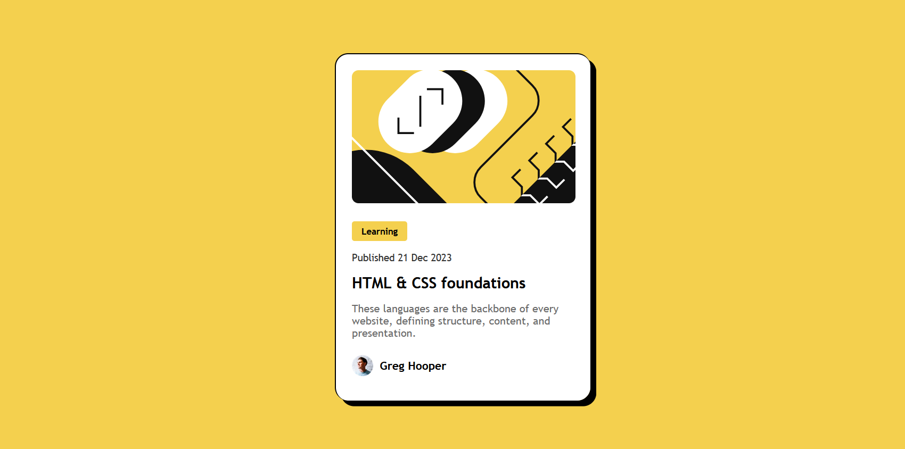
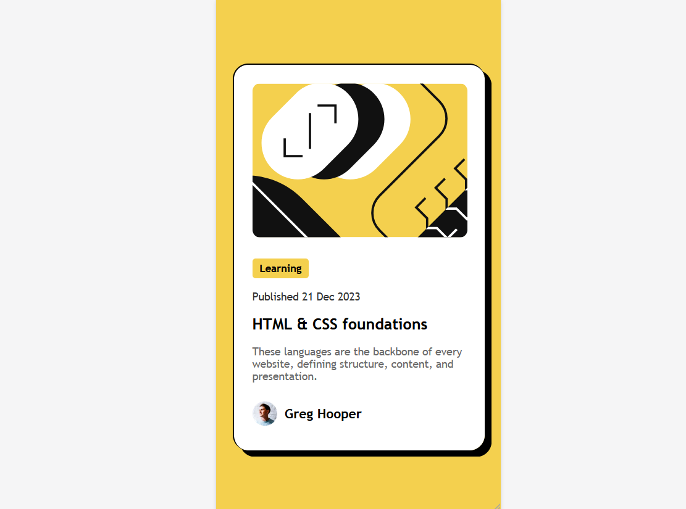
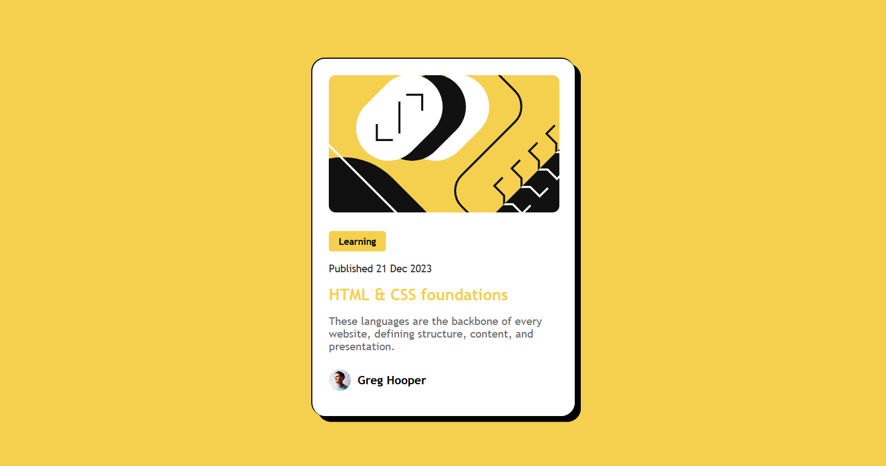

# Frontend Mentor - Blog preview card solution

This is a solution to the [Blog preview card challenge on Frontend Mentor](https://www.frontendmentor.io/challenges/blog-preview-card-ckPaj01IcS). Frontend Mentor challenges help to improve coding skills by building realistic projects.

## Table of contents

- [Overview](#overview)
  - [The challenge](#the-challenge)
  - [Screenshot](#screenshot)
  - [Links](#links)
- [My process](#my-process)
  - [Built with](#built-with)
  - [What I learned](#what-i-learned)
  - [Useful resources](#useful-resources)
- [Author](#author)

## Overview

### The challenge

The goal of this challenge was to create a blog preview card that looks visually appealing and matches the given design. The card includes a blog image, category, title, short description, author's picture, name, and publish date. The component should be responsive on all screen sizes and show hover and focus states on interactive elements like the blog title.

### Screenshot





### Links

- Solution URL: [Frontend mentor solution](https://your-solution-url.com)
- Live Site URL: [Github Pages](https://madiharehman-web.github.io/blog-preview-card/)

## My process

### Built with

- Semantic HTML5 markup
- CSS
- Flexbox for layout
- Mobile-first responsive design
- CSS `rem` units for scalable sizing
- Media queries for responsiveness
- Custom font

### What I learned

Through this project, I improved my understanding of **responsive design** using media queries and `rem` units. I learned how to make components adjust properly on different screen sizes by following a **mobile-first approach**. I also practiced using **Flexbox** to align and space elements consistently within the card layout. Working with Flexbox helped me create a clean and centered structure without using floats or complex positioning.

Here’s a snippet where I applied these concepts:

````css
.card {
  display: flex;
  flex-direction: column;
  gap: 1rem;
  padding: 1.5rem;
  width: 20rem;
}
``` ```html @media (min-width: 768px) {
  .card {
    flex-direction: row;
    width: 40rem;
  }
}
````

### Useful resources

- [MDN Web Docs - Media Queries](https://developer.mozilla.org/en-US/docs/Web/CSS/Media_Queries) – This article helped me learn how to make my design responsive using media queries. I used this to adjust layout and spacing for different screen sizes.
- [MDN Web Docs - rem units](https://developer.mozilla.org/en-US/docs/Learn/CSS/Building_blocks/Values_and_units#relative_length_units) – This page helped me understand how `rem` units work and why they are useful for scalable and accessible designs.

## Author

- Name - Madiha Rehman
- Frontend Mentor - [@yourusername](https://www.frontendmentor.io/profile/MadihaRehman-web)
- GitHub - [MadihaRehman-web](https://github.com/MadihaRehman-web)
